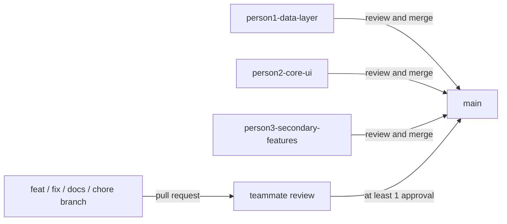
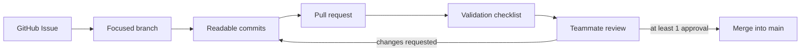

# TravelAI Git Workflow

## Branching Strategy

TravelAI uses GitHub Flow with a stable `main` branch and focused working
branches. The Week 3 contribution history also preserves one ownership branch
for each teammate.



| Branch | Owner | Responsibility | Application commits |
| --- | --- | --- | ---: |
| `person1-data-layer` | `nguyenhuunghia10t1-creator` | Models, Room, APIs, repositories, and DI | 15 |
| `person2-core-ui` | `truongthinh994` | Chat, planner, itinerary, and history UI | 15 |
| `person3-secondary-features` | `AnhKhoaDoan` | Map, weather, scanner, profile, settings, and sharing | 15 |

This strategy fits the project because the ownership areas are easy to review
independently while `main` remains the integration branch.

## Commit Standard

The team uses Conventional Commits:

```text
<type>: <short imperative summary>
```

Use `feat`, `fix`, `docs`, `test`, `refactor`, `style`, or `chore`. Keep the
title readable and add details in the commit body or pull-request description
when the reason is not obvious.

Good:

```text
feat: add trip map markers and day filters
test: cover itinerary parser edge cases
docs: document Git branching strategy
```

Bad:

```text
update
fix stuff
final code
```

## Pull Requests and Reviews

Every new task uses a focused branch and a pull request into `main`.



Reviewers check architecture, logic, security, naming, error handling, scope,
and validation evidence. GitHub Issues track owners and unfinished work.

## Conflict Handling

Prevent conflicts with small pull requests, clear ownership, and frequent
syncs with `main`.

When a conflict occurs:

1. Fetch the latest remote state.
2. Update the task branch from `main`.
3. Resolve each conflicting file locally in Android Studio or VS Code.
4. Ask the owner of the affected area when intent is unclear.
5. Build or run the relevant tests.
6. Push the resolved branch and request another review.

Team rules:

- no force push on `main` or shared branches
- sync before opening a pull request
- keep pull requests focused on one issue
- re-run checks after resolving conflicts

## Week 3 Live Demo

1. Open the repository and show `main` plus the three ownership branches.
2. Show the 15 commits on each ownership branch.
3. Open a merged documentation pull request and show its teammate approval.
4. Open the templates pull request, which remains ready for live review.
5. Show one linked GitHub Issue and the pull-request checklist.
6. Show one Conventional Commit example.
7. Explain the conflict-handling steps and the no-force-push rule.
